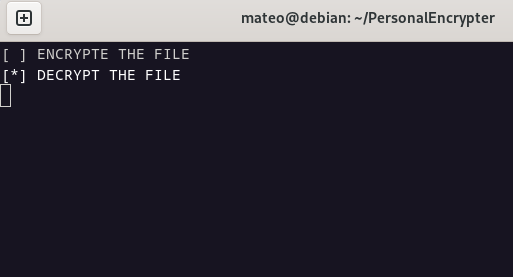

# Encrypter 🔐

Change the **PATH** const in the `main.rs` file, with your path file. Then run `cargo run --release` and encrypt your critic content!

```rust
#[path="./magic_crypt/encrypte_file.rs"]
mod encrypte_file;
#[path="./magic_crypt/decrypt_file.rs"]
mod decrypt_file;
#[path="./io/check_existence.rs"]
mod check_existence;
#[path="./io/menu.rs"]
mod menu;

const PATH: &str = "/password.txt";

fn main(){
    check_existence::check_existence(PATH);
    let encrypte_decrypt_option: u8 = menu::menu();
    match encrypte_decrypt_option {
        0 => encrypte_file::encrypte_file(PATH),
        1 => decrypt_file::decrypt_file(PATH),
        _ => (),
    }
}
```

## Dependencies

```toml
[dependencies]
magic-crypt = "3.1.12"
rpassword = "7.2.0"
termion = "2.0.1"
```

---

<div align="center">



</div>
